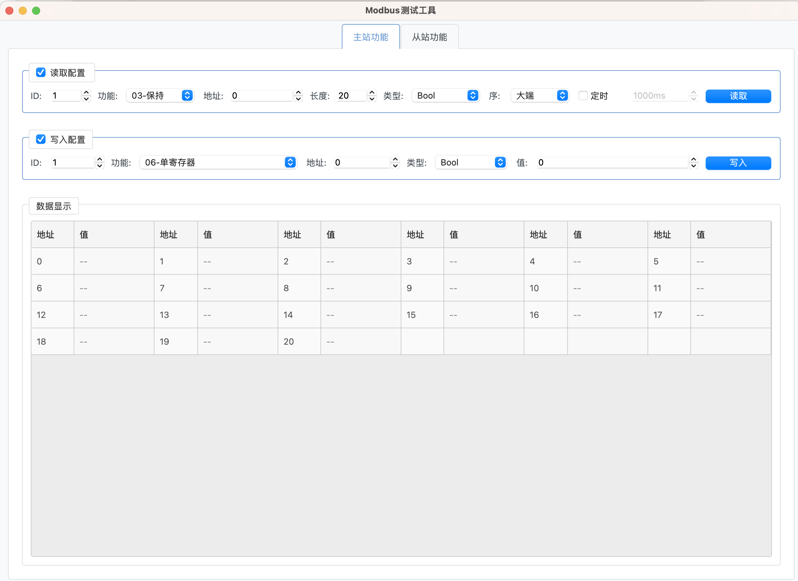

         
# Modbus测试工具

一个基于NodeGUI开发的跨平台Modbus协议测试工具，支持TCP和RTU两种通信方式，提供主站和从站功能。




## 功能特性

### 🔌 连接支持
- **Modbus TCP**: 支持以太网连接，可配置IP地址和端口
- **Modbus RTU**: 支持串口连接，可配置波特率、数据位、停止位、校验位等参数
- 实时连接状态监控
- 自动重连机制

### 📖 主站功能
- **数据读取**
  - 支持功能码：03(保持寄存器)、04(输入寄存器)、01(线圈)、02(离散输入)
  - 多种数据类型：Int16、UInt16、Int32、UInt32、Float32、Float64
  - 大端/小端字节序支持
  - 定时自动读取功能
  - 实时数据表格显示

- **数据写入**
  - 支持功能码：06(写单个寄存器)、16(写多个寄存器)、05(写单个线圈)、15(写多个线圈)
  - 多种数据类型写入支持
  - 实时写入结果反馈

### 🖥️ 从站功能
- **虚拟从站服务器**
  - 可配置从站ID和监听端口
  - 支持保持寄存器、输入寄存器、线圈等数据区域
  - 实时数据显示和手动修改
  - 自动刷新功能

### 📊 数据显示
- 表格化数据展示
- 支持多种数据格式显示
- 实时数据更新
- 操作日志记录


## 安装和运行

### 环境要求
- Node.js 16+
- npm 或 yarn

### 安装依赖
```bash
npm install
```

### 开发运行
```bash
npm run build
npm start
```

### 构建应用
```bash
npm run build
npm run package
```

## 使用说明

### 1. 连接配置
1. 选择协议类型（TCP或RTU）
2. 配置相应的连接参数
3. 点击"连接"按钮建立连接

### 2. 主站操作
1. 确保已建立连接
2. 在"主站功能"标签页中配置读取或写入参数
3. 点击相应按钮执行操作
4. 查看数据显示区域和操作日志

### 3. 从站模拟
1. 在"从站功能"标签页中配置从站参数
2. 点击"启动从站"开始模拟
3. 可以手动修改寄存器数据
4. 查看主站的访问日志

## 项目结构

```
modbus-test/
├── src/
│   └── main.ts          # 主程序文件
├── assets/
│   └── logox200.png     # 应用图标
├── packaging/           # 打包配置
├── package.json         # 项目配置
├── tsconfig.json        # TypeScript配置
└── README.md           # 项目说明
```

## 许可证

MIT License

## 贡献

欢迎提交Issue和Pull Request来改进这个项目。

## 作者

Simon Edwards

---

这是一个功能完整的Modbus协议测试工具，适用于工业自动化、设备调试、协议学习等场景。
        